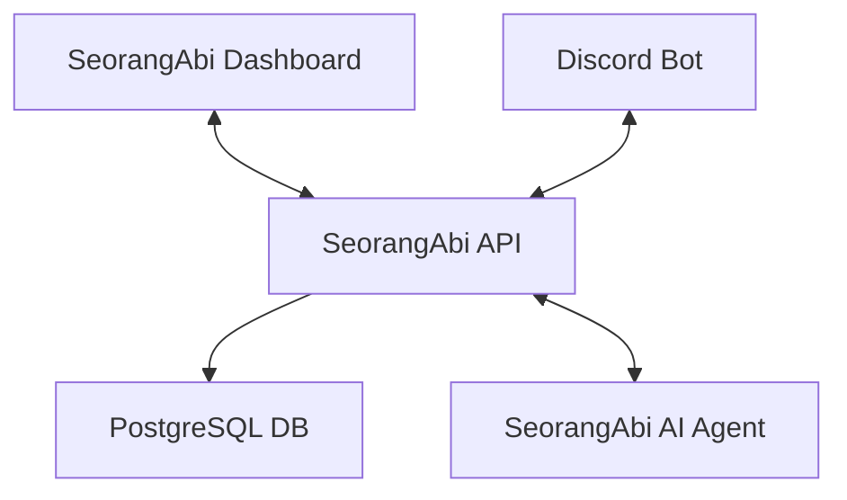

# SeorangAbi Api

SeorangAbi API is a core component of the SeorangAbi platform that serves as the central data provider for the ecosystem. It delivers structured data to the SeorangAbi Dashboard and acts as an integration bridge with Discord, enabling seamless communication and data exchange between various platform components.

This API provides a robust and secure interface for managing projects, teams, tasks, and other essential business resources within the SeorangAbi creative agency platform

## Key Features

- **RESTful API**: Comprehensive endpoints for all platform data needs
- **Discord Bot Integration**: Seamless communication with Discord for team notifications and commands
- **AI Query Interface**: Natural language database queries via integration with SeorangAbi Agent
- **Authentication & Authorization**: Secure access control for all resources
- **Real-time Data**: Up-to-date information for dashboard visualizations
- **Analytics Support**: Endpoints for statistics and reporting

## System Architecture

SeorangAbi API serves as the central hub in the following architecture:



## Technology Stack

- **Hono**: Fast and lightweight web framework
- **Prisma** ORM: Type-safe database client and ORM
- **PostgreSQL**: Primary database
- **Redis**: Caching and session management
- **TypeScript**: Type-safe JavaScript
- **Discord**.js: Discord bot integration
- **JWT**: Authentication mechanism
- **Docker**: Containerization for easy deployment

## API Endpoints

The API provides endpoints for managing the following resources:
- `/team` - Team management
- `/project` - Project management
- `/task` - Task management
- `/offering` - Project offering management
- `/payroll` - Payroll management
- `/statistic` - Platform statistics
- `/discord` - Discord webhook endpoints

## Discord Integration
- `/projects` - View team projects
- `/done` - Mark a project as complete
- `/image-production-per-week` - View weekly production statistics
- `/ask-ai` - Query the database using natural language

## Installation

### Local Development Setup

1. Clone the repository:
  ```bash
  git clone https://github.com/seorangabi/seorangabi-api.git
  cd seorangabi-api
  ```

2. Install dependencies:
  ```bash
  npm install
  ```

3. Set up environment variables:
  ```bash
  cp .env.example .env
  ```  
  Edit .env with your configuration

4. Run database migrations:
  ```bash
  npx prisma migrate dev
  ```

5. Start the development server:
  ```bash
  npm run dev
  ```

### Docker Deployment

Build and run with Docker Compose:
```bash
docker-compose up -d
```